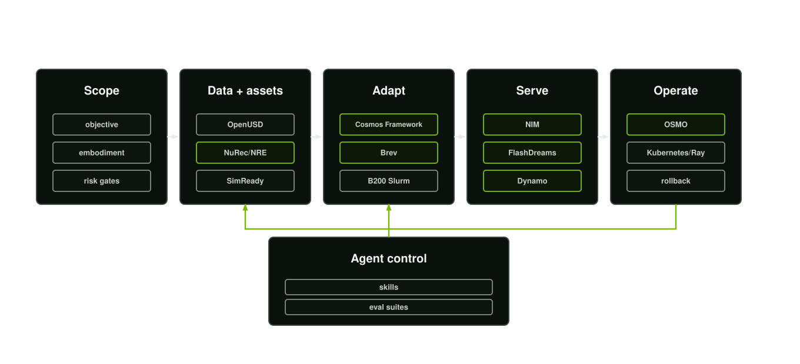

# Fine-Tuned World Model for Sim to Real Blueprint

This blueprint is an operating system for moving from enterprise autonomy data to a fine-tuned world model and a governed sim-to-real loop. It is built for organisations whose advantage lives in the physical world: surgical robotics, agricultural machinery, industrial automation, autonomous vehicles, mobile robots, and smart infrastructure.

The practical question it answers is:

**How do we take the data, assets, machines, logs, simulations, and domain knowledge we already have, turn them into governed process pipelines, fine-tune a Cosmos-class world model, deploy it efficiently, and connect it back to simulation and real systems?**

The answer is agent-driven. A user supplies the programme objective and an LLM endpoint through environment variables. The workflow loads the local Agent Skills, manifest schemas, evidence directory, deployment templates, and benchmark harness, then uses the configured model to drive the programme from intake through data factory, SimReady assets, post-training, infrastructure routing, inference, evaluation, deployment, and governance.

<p align="center">
  
</p>

## Table of contents

- [Overview](#overview)
- [Use case and problem description](#use-case-and-problem-description)
- [What you get](#what-you-get)
- [Agent workflows](#agent-workflows)
- [Software components](#software-components)
- [NIM and LLM runtime](#nim-and-llm-runtime)
- [Target audience](#target-audience)
- [Repository structure overview](#repository-structure-overview)
- [Documentation](#documentation)
- [Prerequisites](#prerequisites)
- [Hardware requirements](#hardware-requirements)
- [Quickstart guide](#quickstart-guide)
- [Launchable workflow](#launchable-workflow)
- [Workflow how-to](#workflow-how-to)
- [Validation and benchmarks](#validation-and-benchmarks)
- [Repository policy](#repository-policy)
- [Sources and attribution](#sources-and-attribution)
- [License](#license)

## Overview

The blueprint turns world-model work into a repeatable enterprise workflow:

1. Analyse the autonomy objective, operating domain, embodiment, risk boundary, and available evidence.
2. Convert real video, action traces, telemetry, simulation output, labels, captions, CAD, and OpenUSD assets into governed manifests.
3. Build the data factory, neural reconstruction lane, Content Agents-style asset creation path, and SimReady pipeline around the physical differentiators of the business.
4. Plan and run Cosmos-class post-training with the right compute lane: Brev for pilots, B200 Slurm and Megatron for larger training, OSMO for multi-stage workflow orchestration, and Kubernetes or Ray where appropriate.
5. Serve the result through the right inference path, including NIM-backed services, framework inference, Dynamo, FlashDreams real-time generation, vLLM, or Transformers.
6. Evaluate, promote, observe, roll back, and feed real-system evidence into the next iteration.

The repository contains all the documents, manifests, skills, scripts, deployment templates, and a benchmark harness needed to operate that loop.

## Use case and problem description

Autonomy teams usually have the raw material for a world model long before they have a world-model programme: robot logs, surgical videos, machine telemetry, field footage, CAD, simulator scenes, operator notes, fault reports, and prototype datasets. The hard part is deciding what matters, what can legally be used, what is missing, which assets must become simulation-ready, how to fine-tune a model, where to run the job, and how to make the result useful in simulation and real operations.

This blueprint is for that gap. It helps a team move from scattered evidence to three concrete outcomes:

- **SimReady business differentiators**: OpenUSD or SimReady assets, neural reconstructions, harvested object assets, scenarios, and synthetic-data pipelines for the objects, tools, machines, behaviours, and environments that make the business hard to copy.
- **An adapted Cosmos-class world model**: a governed, evaluated, versioned model adapted to the target domain and model surface.
- **Efficient inference in the loop**: a serving path that can run the model in batch, simulator, shadow, advisory, or real-time workflows with explicit acceleration, observability, and rollback controls.

## What you get

- A production reference architecture for data strategy, world-model data factory, Cosmos-class post-training, simulation, deployment, and governance.
- A machine-readable manifest layer for intake, datasets, neural assets, SimReady assets, training runs, inference services, evaluations, governance records, and run requests.
- A complete Agent Skills catalogue with skill cards, output contracts, operating playbooks, eval cases, check scripts, and agent metadata.
- A governed neural asset route that invokes the relevant `NVIDIA/skills` or OVRTX capability for NuRec/NRE, Content Agents, CAD-to-SimReady, headless rendering, video augmentation, defect generation, and asset harvesting when those routes are appropriate.
- An agent runtime that sends the programme objective, evidence, and selected skills to an LLM specified by environment variables.
- A Brev Launchable path for smaller runs and planning workflows.
- Deployment templates for Brev, B200 Slurm and Megatron, Kubernetes inference, and OSMO workflows.
- A benchmark and validation harness so the repository behaves like an executable blueprint, not a static document set.

## Agent workflows

The agent workflow is defined in [configs/agent-workflow.json](configs/agent-workflow.json) and executed by `scripts/wmb agent-workflow`. Each stage loads the matching skill from `skills/`, reads the available evidence, and asks the configured LLM to produce decisions, manifest updates, missing evidence, commands, review gates, and the next handoff.

| Workflow stage | Agent skill | Outcome |
| --- | --- | --- |
| Programme intake and evidence strategy | `autonomy-data-strategist` | Target capability, model surface, evidence gap map, routing plan. |
| World model data factory | `world-model-data-factory` | Dataset manifest, curation plan, split policy, augmentation strategy, release gates. |
| Neural reconstruction and asset creation | `neural-asset-reconstruction` | Neural asset manifest, upstream `NVIDIA/skills` or OVRTX invocation plan, Content Agents, NuRec, or headless render route, validation gates. |
| SimReady asset and scenario pipeline | `simready-content-integration` | Asset manifest, OpenUSD or SimReady plan, scenario catalogue, synthetic-data interface. |
| Cosmos-class post-training | `cosmos-post-training-lead` | Training manifest, recipe choice, checkpoint policy, export and evaluation handoff. |
| Infrastructure orchestration | `infrastructure-orchestration-lead` | Run request, Brev or cluster route, scheduler contract, launch evidence. |
| Real-time and batch inference | `real-time-inference-lead` | Inference manifest, NIM or framework backend, FlashDreams path, cache and rollback controls. |
| Evaluation and safety promotion | `evaluation-safety-lead` | Evaluation manifest, promotion gates, safety regressions, failure review. |
| Deployment operations | `deployment-operations-lead` | Integration plan, observability, access control, incident handling, rollback. |
| Governance and provenance | `governance-provenance-lead` | Rights, privacy, export control, retention, access, approvals, risk acceptance. |

The workflow is intentionally sequential for the first pass. Individual stages can also be run with `--stage` when a programme owner wants to focus the LLM on one skill.

## Software components

| Component | Purpose |
| --- | --- |
| [README.md](README.md) | Blueprint entry point, quickstart, and operator workflow. |
| [docs/](docs/) | Detailed architecture, data strategy, post-training, deployment, governance, infrastructure, benchmarks, and source map. |
| [skills/](skills/) | Production Agent Skills that drive the workflow. |
| [schemas/](schemas/) | JSON contracts for manifests and run requests. |
| [configs/agent-workflow.json](configs/agent-workflow.json) | Ordered agent workflow and default LLM configuration. |
| [scripts/wmb](scripts/wmb) | CLI for formatting, validation, manifest generation, readiness, run planning, skill audits, and agent workflow execution. |
| [scripts/wmb-agent-launchable](scripts/wmb-agent-launchable) | Brev-oriented launch command for validation, manifest setup, readiness, benchmarks, and agent workflow execution. |
| [benchmarks/](benchmarks/) | Benchmark harness for repository and skill packaging checks. |
| [deploy/](deploy/) | Brev, Slurm, Kubernetes, and OSMO deployment templates. |

## NIM and LLM runtime

The agent runtime uses an OpenAI-compatible chat completion endpoint. The default configuration is compatible with NVIDIA hosted NIM endpoints used by current NVIDIA blueprint patterns:

```bash
cp deploy/.env.example deploy/.env
```

Set the runtime in `deploy/.env`:

```bash
WMB_LLM_API_KEY=
NVIDIA_API_KEY=
WMB_LLM_BASE_URL=https://integrate.api.nvidia.com/v1
WMB_LLM_MODEL=nvidia/nemotron-3-nano-30b-a3b
```

`WMB_LLM_API_KEY` takes precedence. `NVIDIA_API_KEY` is accepted as the default fallback because it is the standard environment variable used by NVIDIA hosted NIM workflows.

For a local NIM endpoint, set:

```bash
WMB_LLM_BASE_URL=http://localhost:8001/v1
WMB_LLM_MODEL=<served-model-name>
```

When the local endpoint does not enforce bearer-token authentication, a controlled environment may set `WMB_LLM_REQUIRE_API_KEY=false`. Keep that setting out of shared deployment files unless the local security owner has approved it.

NIMs can be used in three places:

- **Agent LLM**: the model that operates the skills and produces workflow artefacts.
- **Data and evidence services**: embedding, VLM, captioning, retrieval, and video-understanding services that help the data factory analyse source material.
- **Neural asset services**: NIM-compatible LLM/VLM surfaces for Content Agents-style reasoning, asset validation prompts, captioning, review summarisation, and service-oriented orchestration where available.
- **World-model and inference services**: Cosmos WFM serving, NIM-backed APIs, framework inference, or accelerated services selected by the inference manifest.

## Target audience

This blueprint is intended for:

- Autonomy engineering leaders deciding how to turn proprietary physical-world data into a governed world-model capability.
- ML and simulation teams building Cosmos-class adaptation, synthetic data, SimReady assets, and sim-to-real evaluation loops.
- Infrastructure teams responsible for Brev pilots, B200 clusters, Slurm, Megatron, Kubernetes, OSMO, NIM, FlashDreams, and inference operations.
- Safety, regulatory, legal, quality, and governance owners who need evidence trails rather than informal model experiments.

## Repository structure overview

| Path | Description |
| --- | --- |
| `docs/` | Blueprint documents, architecture diagram, source map, deployment, governance, and benchmark guidance. |
| `skills/` | Agent Skills with frontmatter, skill cards, playbooks, output contracts, evals, scripts, and agent metadata. |
| `schemas/` | JSON schemas used by the manifest and readiness tooling. |
| `configs/` | Agent workflow and LLM configuration. |
| `scripts/` | CLI entry points and Launchable automation. |
| `deploy/brev/` | Pilot and Launchable execution guidance. |
| `deploy/slurm/` | B200-class Slurm and Megatron training template. |
| `deploy/kubernetes/` | Inference service deployment template. |
| `deploy/osmo/` | Multi-stage OSMO workflow template. |
| `benchmarks/` | Benchmark specification and runner. |

## Documentation

| Topic | Entry point |
| --- | --- |
| Primary blueprint | [docs/blueprint.md](docs/blueprint.md) |
| Reference architecture | [docs/reference-architecture.md](docs/reference-architecture.md) |
| Data strategy | [docs/data-strategy.md](docs/data-strategy.md) |
| Cosmos post-training | [docs/post-training.md](docs/post-training.md) |
| Infrastructure and execution | [docs/infrastructure.md](docs/infrastructure.md) |
| Deployment and integration | [docs/deployment.md](docs/deployment.md) |
| Agent system | [docs/agent-system.md](docs/agent-system.md) |
| Governance | [docs/governance.md](docs/governance.md) |
| Toolchain | [docs/toolchain.md](docs/toolchain.md) |
| Manifest contracts | [docs/manifest-contracts.md](docs/manifest-contracts.md) |
| Benchmarks | [docs/benchmarks.md](docs/benchmarks.md) |
| Source map | [docs/source-map.md](docs/source-map.md) |

## Prerequisites

- Python 3.10 or newer.
- Bash, Git, and Make.
- Network access to the selected LLM endpoint when running the agent workflow.
- `deploy/.env` with the selected LLM key and model configuration.
- Optional: Docker and NVIDIA Container Toolkit for local NIMs or containerised services.
- Optional: Brev account for Launchable execution.
- Optional: Slurm, Kubernetes, Ray, OSMO, or Megatron access for larger runs.

## Hardware requirements

| Workload | Typical lane | Notes |
| --- | --- | --- |
| Documentation, manifest generation, validation, and dry-run agent prompts | CPU workstation | No GPU required. |
| Agent workflow with hosted NIM LLM | CPU workstation or Brev | Inference runs on the hosted endpoint. |
| Small data-factory experiments, smoke tests, and pilot adaptation | Brev or local GPU workstation | Use `/ephemeral` for generated artefacts and caches on Brev. |
| Larger Cosmos-class post-training | B200-class Slurm, Megatron, or equivalent cluster | Requires programme-specific recipe, dataset, checkpoint, and scheduler review. |
| Multi-stage simulation, training, evaluation, and hardware-in-the-loop | OSMO, Kubernetes, Ray, or cluster workflow manager | Use the run-plan and deployment templates as launch contracts. |
| Real-time or interactive inference | NIM, FlashDreams, Dynamo, framework inference, or edge runtime | Backend is selected through the inference service manifest. |

## Quickstart guide

Clone the private repository:

```bash
git clone git@github.com:chrisvoncsefalvay/world-model-blueprint.git
cd world-model-blueprint
```

Run the baseline checks:

```bash
make validate
make skill-audit
make benchmarks
```

Configure the LLM runtime:

```bash
cp deploy/.env.example deploy/.env
```

Set either `WMB_LLM_API_KEY` or `NVIDIA_API_KEY` in `deploy/.env`, then set `WMB_AGENT_OBJECTIVE` to the authorised programme objective.

Generate the manifest workspace:

```bash
mkdir -p artifacts/manifests
for schema in schemas/*.schema.json; do
  scripts/wmb new-manifest \
    --schema "$schema" \
    --output "artifacts/manifests/$(basename "$schema" .schema.json).json"
done
```

Fill the generated manifests from authorised evidence, then check readiness:

```bash
scripts/wmb readiness-report \
  --root artifacts/manifests \
  --output artifacts/readiness.md
```

Run the agent workflow:

```bash
scripts/wmb agent-workflow \
  --config configs/agent-workflow.json \
  --env-file deploy/.env \
  --evidence-root artifacts/manifests \
  --output artifacts/agent-workflow.md
```

For a focused run:

```bash
scripts/wmb agent-workflow \
  --env-file deploy/.env \
  --evidence-root artifacts/manifests \
  --stage post-training \
  --output artifacts/post-training-agent-plan.md
```

## Launchable workflow

The Brev Launchable path is the fastest way to run most of the pilot workflow in one environment:

```bash
cp deploy/.env.example deploy/.env
```

Set `WMB_LLM_API_KEY` or `NVIDIA_API_KEY`, set `WMB_AGENT_OBJECTIVE`, then run:

```bash
scripts/wmb-agent-launchable
```

The Launchable command:

1. Loads `deploy/.env` without printing secret values.
2. Uses `/ephemeral/world-model-blueprint/${USER}` for generated artefacts and caches when `/ephemeral` exists.
3. Runs validation, skill audit, and benchmarks.
4. Generates any missing manifest skeletons.
5. Produces a readiness report.
6. Runs the agent workflow over the manifest directory.

The notebook wrapper is [deploy/brev/world-model-launchable.ipynb](deploy/brev/world-model-launchable.ipynb), and the operator contract is [deploy/brev/launchable-workflow.md](deploy/brev/launchable-workflow.md).

## Workflow how-to

1. **State the objective**: write the authorised autonomy objective, deployment scope, embodiment, and intended model output into `WMB_AGENT_OBJECTIVE` and the programme intake manifest.
2. **Inventory evidence**: collect real observations, simulation output, telemetry, actions, CAD, OpenUSD, labels, captions, quality records, and rights evidence into controlled storage; reference them in manifests rather than copying restricted data into the repo.
3. **Run intake**: execute the `intake` agent stage to clarify the model surface, missing evidence, review gates, and downstream routing.
4. **Build the data factory**: use the `data-factory` stage to define curation, captioning, annotation, augmentation, split policy, quality gates, and release criteria.
5. **Reconstruct, render, or create assets**: use the `neural-assets` stage to divert to the NVIDIA Neural Reconstruction agentic routes, by pushing route sensor captures, USD assets, CAD, video gaps, previews, rendered videos, simulation frames, and defect examples to the correct `nvidia/skills` or OVRTX capability, with NIM or service-surface choices recorded honestly.
6. **Make the differentiators simulation-ready**: use the `simready` stage to decide which assets and scenarios must become OpenUSD or SimReady artefacts.
7. **Plan post-training**: use the `post-training` stage to select the Cosmos-class adaptation route, recipe, checkpoint policy, and evaluation handoff.
8. **Route compute**: use `run-plan` and the `infrastructure` stage to choose Brev, B200 Slurm, Megatron, OSMO, Kubernetes, Ray, or local execution.
9. **Serve efficiently**: use the `inference` stage to select NIM, FlashDreams, Dynamo, Cosmos Framework inference, non-Framework Cosmos inference (vLLM, Transformers), cache policy, precision, graph capture, observability, and rollback.
10. **Promote only with evidence**: use the `evaluation`, `deployment`, and `governance` stages to define promotion gates, integration mode, access control, safety acceptance, incident handling, and provenance.

## Validation and benchmarks

Use these commands before treating a change or programme artefact as ready for review:

```bash
make validate
make format-check
make skill-audit
make benchmarks
git diff --check
```

The benchmark harness writes to `artifacts/benchmark-report.json`, which is intentionally ignored by Git. Programme-specific artefacts should remain in controlled programme systems or ignored local artefact directories.

## Roadmap 

- [x] Initial structure
- [x] Key functional flow
- [x] Ancillary functional flow
- [x] Skill cards and structure
- [x] Agentic enablement
- [x] Architecture visuals
- [ ] UI
- [ ] End to end demo

## License

Apache-2.0.

This blueprint draws on some practices established in public NVIDIA and Agent Skills materials listed in [docs/source-map.md](docs/source-map.md), including NVIDIA AI Blueprints, NVIDIA AI-Q, NVIDIA Omniverse Blueprints, Agent Skills, Cosmos, NIM, Omniverse, Isaac Sim, OpenUSD, SimReady, OSMO, FlashDreams, Megatron, and relevant regulatory and safety frameworks.

NVIDIA, Cosmos, NIM, NeMo, Omniverse, Isaac, TAO, and related names are trade marks of NVIDIA Corporation.

The World Model Blueprint was developed at HCLTech in early 2026 and updated for the capabilities of Cosmos-3. While it draws on NVIDIA's skill and blueprint architecture in the interests of smooth integration with the NIM/Brev and Omniverse ecosystems, it is an independent product and is not endorsed or approved by NVIDIA.

