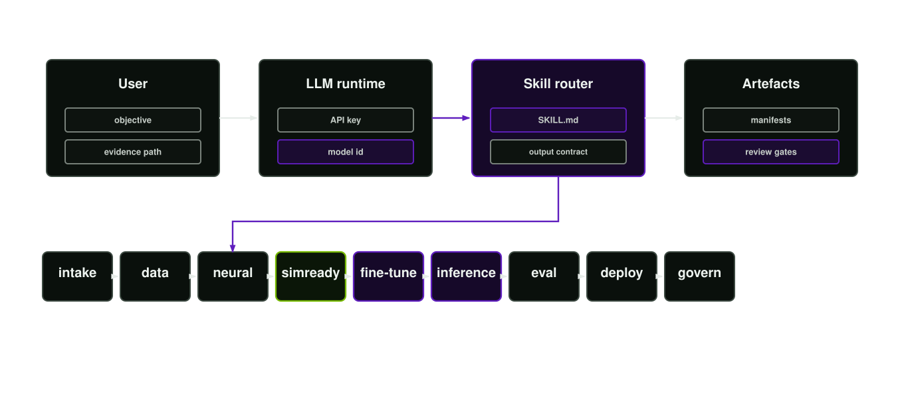

# Agent system

## Purpose

The blueprint uses agents to make complex autonomy workflows repeatable. Each agent is a bounded operator with a skill, a governance card, and a defined output. Agents can research, inspect, prepare plans, generate manifests, and assemble evidence. They do not silently change infrastructure, publish data, promote models, or deploy to real systems.

## Runtime model

The executable workflow is defined in `configs/agent-workflow.json` and run with `scripts/wmb agent-workflow`. The operator supplies:

- a programme objective;
- an evidence directory containing manifests or controlled evidence summaries;
- an LLM endpoint through `deploy/.env`;
- optional stage selection when only one skill should run.

The runner loads the selected skill's `SKILL.md`, skill card, output contract, programme objective, and evidence directory, then sends that package to the configured OpenAI-compatible chat endpoint. The default configuration targets the NVIDIA hosted NIM-compatible endpoint and accepts `NVIDIA_API_KEY` as the fallback key. Local NIM deployments can be used by setting `WMB_LLM_BASE_URL` and `WMB_LLM_MODEL`.

The model output is written to a programme artefact path. It is a planning and evidence artefact, not an automatic approval, deployment, or promotion.

  

## Skill packaging

Each skill follows the Agent Skills pattern:

- A directory under `skills/`.
- A required `SKILL.md`.
- YAML frontmatter with `name` and `description`.
- Concise instructions in the body.
- Optional references loaded only when needed.
- A `skill-card.md` documenting purpose, ownership, outputs, risks, and operating boundaries.

The skills are substantial but modular. Activation instructions stay focused on the agent's job, while operating playbooks, output contracts, benchmark cases, scripts, and metadata carry the detailed execution surface.

Each skill also includes:

- `BENCHMARK.md` with acceptance criteria.
- `references/` for detailed operating playbooks and output contracts.
- `scripts/run-checks.sh` for deterministic manifest validation.
- `evals/benchmark-cases.json` for machine-readable evaluation cases.
- `agents/openai.yaml` for UI-facing skill metadata.

## Skill catalogue

| Skill | Primary output |
| --- | --- |
| `autonomy-data-strategist` | Data adaptation brief and gap analysis. |
| `world-model-data-factory` | Dataset curation and enrichment plan. |
| `neural-asset-reconstruction` | NuRec/NRE, Content Agents, OVRTX headless rendering, CAD-to-SimReady, asset harvesting, augmentation, and validation route. |
| `simready-content-integration` | Simulation asset and scenario integration plan. |
| `cosmos-post-training-lead` | Cosmos adaptation plan and run manifest. |
| `infrastructure-orchestration-lead` | Brev, OSMO, Slurm, Megatron, Kubernetes, and Ray execution plan. |
| `real-time-inference-lead` | FlashDreams, NIM, Dynamo, vLLM, caching, graph capture, and serving plan. |
| `evaluation-safety-lead` | Evaluation and promotion gate plan. |
| `deployment-operations-lead` | Serving and integration plan. |
| `governance-provenance-lead` | Governance, rights, and audit record plan. |

## Operating boundaries

Agents must stop for human review when a task involves:

- Secrets, access tokens, or private credentials.
- Customer or regulated data.
- Data rights or consent ambiguity.
- Model promotion.
- Deployment to a real system.
- Safety acceptance.
- External publication.
- Destructive infrastructure changes.

## Content agents and Physical AI skills

The blueprint treats Content Agents, Omniverse skills, OVRTX, Physical AI video data augmentation, Physical AI defect image generation, NuRec/NRE, NCore, Asset Harvester, VSS, TAO, OSMO, FlashDreams, Megatron, and `NVIDIA/skills` as upstream capability families. The local skills do not copy those products. They tell the operator when to use the corresponding capability and what evidence to capture before and after use.

`neural-asset-reconstruction` is the explicit router for this layer. It should name the exact upstream skill, such as `physical-ai-neural-reconstruction`, `omniverse-cad-to-simready`, `physical-ai-video-data-augmentation`, `physical-ai-defect-image-generation`, or the relevant `NVIDIA-Omniverse/ovrtx/skills` entry, and then hand the resulting artefact to `simready-content-integration`, `world-model-data-factory`, or the relevant validation owner.
