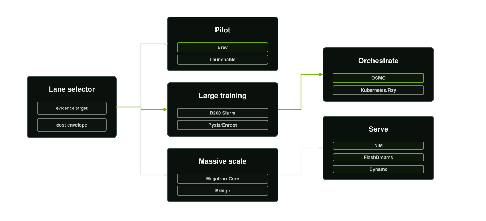
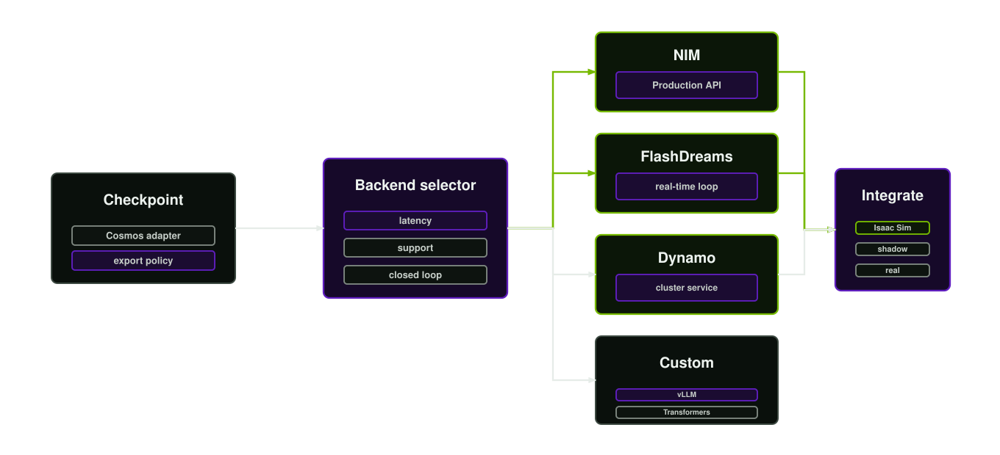

# Cosmos post-training strategy

## Purpose

Post-training adapts a Cosmos 3-class model to the target autonomy domain. It is not the first step. Baseline evaluation, data curation, simulation coverage, and safety requirements come first.

## Model surfaces

Use the surface that matches the product need:

- **Reasoner** for video understanding, spatial grounding, physical reasoning, temporal localisation, task planning, and action forecasting.
- **Generator** for world generation, future prediction, video transformation, synthetic data generation, and action-conditioned rollouts.
- **Action modes** for forward dynamics, inverse dynamics, policy-like action prediction, and embodiment-specific rollout evaluation.

## Training path

Cosmos Framework is the primary training and checkpoint path. The programme should use framework documentation and recipe artefacts as the implementation contract:

- Prepare data in the supported dataset format, including structured captions where required.
- Convert the base checkpoint into the format expected by the trainer.
- Use the paired SFT recipe and launch shell where available.
- Record resolved configuration, launch metadata, checkpoint state, and run environment.
- Export the adapted checkpoint to a serving-compatible format.

The framework examples include vision SFT, reasoner alignment SFT, and Cosmos 3 Nano and Super recipe paths. Hardware, parallelism, and memory constraints should be taken from the current framework support notes for the selected recipe.

Create the training run contract before launch:

```bash
scripts/wmb new-manifest --schema schemas/training-run-manifest.schema.json --output artifacts/training-run.json
scripts/wmb validate-manifest --schema schemas/training-run-manifest.schema.json --manifest artifacts/training-run.json
```

The manifest should be resolved from programme records, not conversational assumptions. It becomes the handoff between data factory, post-training, infrastructure, evaluation, and deployment owners.

## Execution lanes

Choose the execution lane before launching training:

<p align="center">
  
</p>

| Lane | Use for | Operating notes |
| --- | --- | --- |
| Local GPU workstation | Smoke tests, dataset inspection, captioning pilots, small inference checks | Keep runs short, record exact driver and container state, and do not treat local success as production readiness. |
| Brev GPU instance | Small or medium pilot runs, single-node multi-GPU SFT, evaluation, and demo-quality inference | Brev is instance-based. Use it when the job can fit on one instance and data can be staged to object storage or the instance filesystem. |
| Slurm on B200-class clusters | Large SFT, long multi-GPU runs, high-throughput evaluation, and production-scale checkpoint generation | Use shared storage, scheduler-owned allocations, containerised jobs, explicit `sbatch` or launcher configuration, and checkpoint intervals aligned with queue policy. |
| Megatron Bridge and Megatron-Core | Massive distributed training, large-scale SFT or PEFT, long context, MoE, parallelism optimisation, and performance-critical model work | Pick a recipe, size TP/PP/CP/EP/DP against the topology, use Slurm-native or site-approved launchers, and validate resiliency and checkpoint format before scale-out. |
| Kubernetes, Ray, or OSMO | Cloud-native training, OSMO workflows, NIM Operator, Ray-based jobs, simulation, HIL, and service-adjacent training pipelines | Validate GPU scheduling, storage classes, image-pull secrets, service accounts, pools, and cluster health before submitting. |

For B200-class cluster runs, keep training data and checkpoints on shared high-performance storage rather than local paths. The run manifest should include node count, GPUs per node, partition or queue, container image, mounts, cache paths, checkpoint cadence, rendezvous configuration, and log locations.

## Adaptation decision tree

1. **Prompting and retrieval**: Use when the base model already understands the domain but needs current context, operating procedures, or citations.
2. **Captioning and curation**: Use when failure is caused by weak data description or poor sample selection.
3. **Parameter-efficient adaptation**: Use when the target domain is narrow and the base model is strong.
4. **Supervised fine-tuning**: Use when the input-output contract differs materially from the base model behaviour.
5. **Action post-training**: Use when the model must consume or emit embodiment-specific action sequences.
6. **Ancillary model training**: Use TAO or other NVIDIA tooling when the problem is better served by perception, embedding, retrieval, annotation, or a task-specific model rather than world-model adaptation.

## Data contracts

The training dataset must specify:

- Modality and file format.
- Clip duration and frame rate.
- Resolution and aspect ratio policy.
- Caption or label schema.
- Action schema and dimensionality, if applicable.
- Split assignment.
- Source lineage and review state.
- Safety and privacy classification.

For video-captioned SFT, keep both structured captions and dense narratives where the recipe supports that pattern. Use the structured representation for consistency between training and inference when required.

## Evaluation before promotion

Every adapted checkpoint is compared against the base model and previous promoted version. Evaluation should cover:

- Target-task accuracy or utility.
- Temporal consistency.
- Physical plausibility.
- Action validity.
- Scenario coverage.
- Real, synthetic, and simulation slices.
- Failure mode recurrence.
- Safety and policy behaviour.
- Latency, cost, memory, and serving stability.

The adapted model is not promoted because it performs better on a training metric. It is promoted only when the evidence supports the deployment scope.

## Serving handoff

NIM is the preferred production surface when the required Cosmos model and mode are available. FlashDreams is the preferred lane for interactive autoregressive video or world-model inference, including self-forcing and closed-loop simulation patterns. Cosmos Framework inference, vLLM, or Transformers may be used for research, custom checkpoints, and workflows not yet represented as a NIM. The serving handoff must include the model artefact, data manifest, evaluation report, limitations, runtime settings, and rollback target.

<p align="center">
  
</p>

The training owner and deployment owner should agree the serving path before the first expensive run. A checkpoint that cannot be exported, loaded, monitored, or rolled back is not production work.

## Inference acceleration plan

For each adapted model, choose and document the applicable acceleration techniques:

- NIM runtime optimisation where a supported model surface exists.
- FlashDreams streaming pipeline for autoregressive video and world models.
- KV-cache and AR-cache reuse for sequential rollouts.
- Context parallelism, data parallel sharding, and classifier-free guidance parallelism for multi-GPU serving.
- CUDA graph capture for stable repeated execution.
- BF16 or other validated precision modes.
- Batch scheduling for throughput-oriented generation.
- Model-cache placement on local NVMe or cluster persistent volumes.
- vLLM or Transformers serving only after memory, latency, and correctness checks.

Acceleration is useful only if it preserves the model contract. Any change to precision, batching, scheduler, cache policy, or graph capture requires regression testing on the promotion suite.
